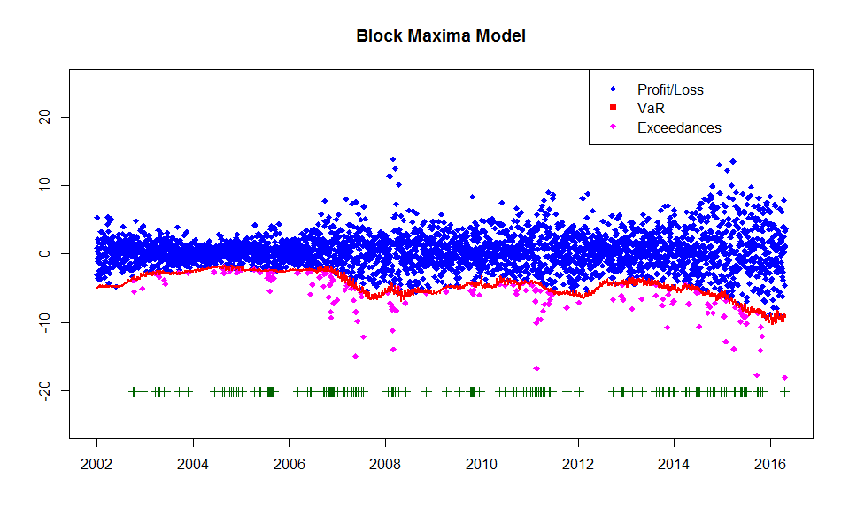

# SFS01-VaR-blockmaxima-backtesting
[](http://quantlet.de/index.php?p=info)

## [](http://quantlet.de/) **SFS01-VaR-blockmaxima-backtesting** [](http://quantlet.de/d3/ia)

```yaml

Name of QuantLet : SFS01-VaR-blockmaxima-backtesting

Published in : Statistics of Financial Markets 

Description : Provides backtesting results for Value-at-Risk under the Block Maxima Model with 0.05 level for the portfolio formed by Bayer, BMW, Siemens shares during from 2002-01-01 to 2016-06-30.

Keywords : portfolio, risk, VaR, backtest, block-maxima, estimation, exceedance, outlier, plot

Author : Liang chen, Du yao, Feng xiaowei, Zi xuefei

Submitted : July 15th,2016

Datafiles: Bayer-close-0216.txt, Bmw-close-0216.txt, Siemens-close-0216.txt, VaR-0216-Matlab.txt, VaR-0216-R.txt

Input:
- a,b,c : vector of returns
- v : values of Value-at-Risk
- h : size of the window

Output:
- p : exceedance ratio
- Plot : the Value-at-Risk estimation results for a portfolio of Bayer, BMW and Siemens stock.

```



# MATLAB code
```matlab
clear;clc;
%load data
A=load('Bayer_close_0216.txt');
B=load('Bmw_close_0216.txt');
C=load('Siemens_close_0216.txt');
%create portfolio
E=A+B+C;
n=length(E);
X=E(2:n)-E(1:(n-1));
P=-X;
T1=length(P);
h=250;
p=0.95;
n=16;

%define some useful vectors
n1=T1-h;
shape=zeros(n1,1);%shape parameter
scale=zeros(n1,1);%scale parameter
position=zeros(n1,1);%position parameter
pt=zeros(h,1);

%estimate parameters of GEV
for i=1:n1
    pt=P(i:i+249,1);
    c=block(pt,16,'max');%block sample
    parmhat=gevfit(c);
    shape(i,1)=parmhat(1);
    scale(i,1)=parmhat(2);
    position(i,1)=parmhat(3);
    warning off
end

%calculate VaR
var=zeros(n1,1);
for j=1:n1
   var(j,1)=position(j,1)+scale(j,1)/shape(j,1)*((-log(1-p^n))^(-shape(j,1))-1);
end

 fid = fopen('VaR_0216_Matlab.txt','wt');
 fprintf(fid,'%g\n',var);       
 fclose(fid);
```
# MATLAB code 
```matlab
clear;clc;
%load data
A=load('Bayer_close_0216.txt');
B=load('Bmw_close_0216.txt');
C=load('Siemens_close_0216.txt');
v=load('VaR_0216_Matlab.txt');

%Size of window
h = 250;
v = -v;
V = A + B + C;
D = length(V);
L = V(2:D)-V(1:(D-1));
T = length(L);

outlier = zeros(T-h,1);
exceedVaR = zeros(D-h-1,1);
yplus = zeros(T-h,1);

%Check for exceedances
for l=1:(T-h)
    if L(h+l,1)<v(l,1)
        exceedVaR(l,1)=1;
    end
end

%Find exceedances
for m=1:(T-h)
    if exceedVaR(m,1)==1
        outlier(m,1)=L(m+h,1);
        yplus(m,1)=min(L((h + 1):(D - 1),1)) - 2;
    else outlier(m,1)=NaN;
        yplus(m,1)=NaN;
    end
end


%Calculate the exceedance ratio
p_hat = sum(exceedVaR)/(T - h);

%Plot the values, VaR estimation and the exceedances
plot(L((h+1):(D-1),1),'b.','MarkerSize',10)
grid on
hold on
plot(v,'r-')
plot(outlier,'m.','MarkerSize',10);
plot(yplus,'g+');
hold off
legend('Profit/Loss','VaR','Exceedences')
title('Block Maxima Model')
xlim([-100,3535])
ylim([-25,25])
set(gca,'XTick',[0 480 960 1440 1920 2400 2880 3260])
set(gca,'XTickLabel',{'2002' '2004' '2006'  '2008' '2010' '2012' '2014' '2016'})

```
# R code
```r
# clear variables and close windows
rm(list = ls(all = TRUE))
graphics.off()

# install and load packages
libraries = c("ismev")
lapply(libraries, function(x) if (!(x %in% installed.packages())) {
install.packages(x)
})
lapply(libraries, library, quietly = TRUE, character.only = TRUE)

# load data
a = read.table("Bayer_close_0216.txt")
b = read.table("Bmw_close_0216.txt")
c = read.table("Siemens_close_0216.txt")

# Create portfolio
e = a + b + c
e = as.matrix(e)               # define as matrix
end = NROW(e)                  # number of observations
x = e[2:end] - e[1:(end - 1)]  # returns
x = -x                         # negative returns
T = length(x)                  # number of observations 
h = 250                        # observation window
p = 0.95                       # quantile for VaR
n = 16                         # observation window for estimating quantile in VaR
k = T/n

# Evaluate VaR
mu = matrix(, , , )
sigma = matrix(, , , )
gamma = matrix(, , , )
VaR = matrix(, , , )

for(i in 1:(T-250)) {
y = x[i:(i+249)]
z = matrix(, , , )

for (j in 1:k) {
    r = y[((j - 1) * n + 1):(j * n)]
    z[j] = max(r)
}
w = sort(z)

GEV = gev.fit(w)  # Fit the Generalized Extreme Value Distribution

mu[i] <- GEV$mle[1]  # location parameter
sigma[i] <- GEV$mle[2]   # scale parameter
gamma[i] <- GEV$mle[3]  # shape parameter

VaR[i]<- mu[i]+sigma[i]/gamma[i]*((-log(1-p^n))^(-gamma[i])-1)
}


write(VaR, file = "VaR_0216_R.txt",ncolumns =1,sep = "\t")
```
# R code
```r
# clear variables and close windows
rm(list = ls(all = TRUE))
graphics.off()

# install and load packages
libraries = c("ismev")
lapply(libraries, function(x) if (!(x %in% installed.packages())) {
    install.packages(x)
})
lapply(libraries, library, quietly = TRUE, character.only = TRUE)

# load data
a = read.table("Bayer_close_0216.txt")
b = read.table("Bmw_close_0216.txt")
c = read.table("Siemens_close_0216.txt")
v = read.table("VaR_0216_R.txt")

# Size of window
h = 250
v = -v
V = a + b + c
D = dim(V)
L = V[-1, ] - V[1:(D[1] - 1), ]
T = length(L)


outlier = matrix(, 1, T - h)
exceedVaR = matrix(, , )

# Check for exceedances
exceedVaR = (L[(1 + h):(D[1] - 1)] < v[1:(T - h), ])

# Find exceedances
for (j in 1:(T - h)) {
    if (exceedVaR[j] == TRUE) {
        outlier[j] = L[j + h]
    }
}

K.1 = which(is.finite(outlier))
K = is.finite(outlier)
outlier = outlier[K.1]

# Calculate the exceedance ratio
p = round(sum(exceedVaR)/(T - h), 4)

# Plot the values, VaR estimation and the exceedances
# setwd('c:\\Users\\hp\\Desktop\\SFS01_VaR_blockmaxima_backtesing')
# #save photo png(file='VaR_blockmax_backtesting.png', bg='transparent')

plot(L[(h + 1):(D[1] - 1)], pch = 18, col = "blue", ylim = c(-25, 25), xlab = c(""), 
    ylab = c(""), axes = FALSE)
box()
axis(1, seq(0, length = 8, by = 480), seq(2002, 2016, by = 2))
axis(2)
title("Block Maxima Model")
points(K.1, outlier, pch = 18, col = "magenta")
lines(v, col = "red", lwd = 2)

yplus = K.1 * 0 + min(L[(h + 1):(D[1] - 1)]) - 2
points(K.1, t(yplus), pch = 3, col = "dark green")
legend("topright", c("Profit/Loss", "VaR", "Exceedances"), pch = c(18, 15, 18), 
    col = c("blue", "red", "magenta"))
# dev.off()

# Print the exceedances ratio
print(paste("Exceedances ratio:", "", p))

